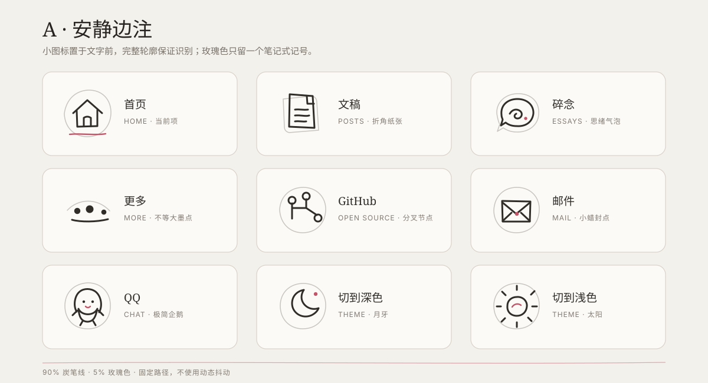
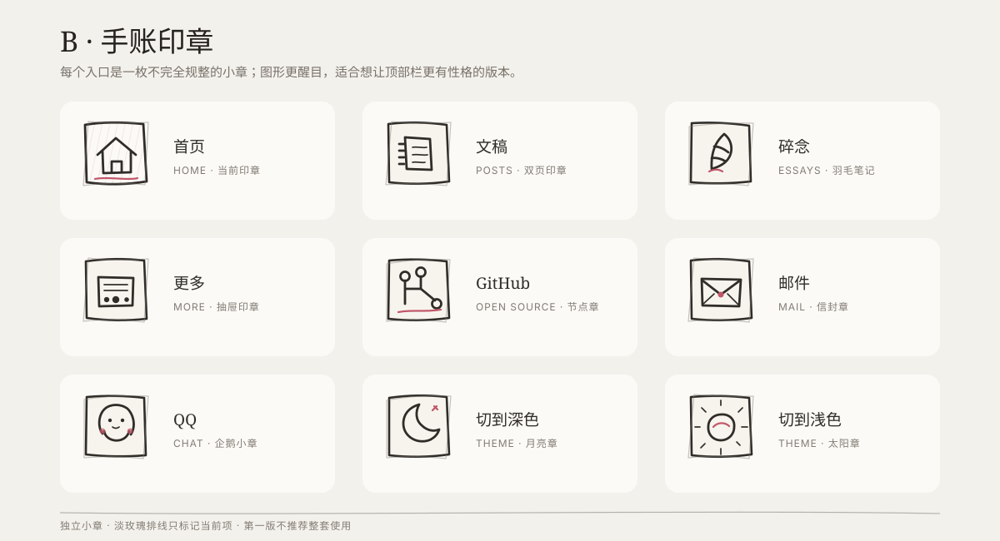
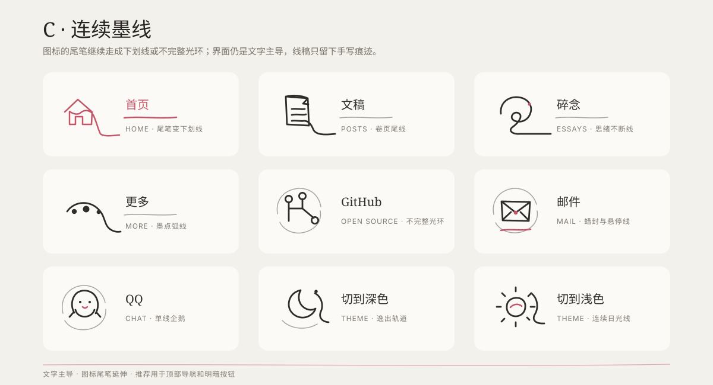
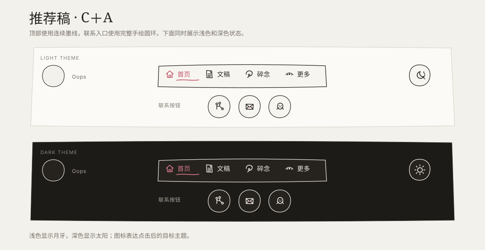

# 顶部导航与联系控件手绘化设计

> 状态：方案 A 已选择并完成实现
> 日期：2026-07-27
> 范围：桌面端顶部导航、明暗主题按钮、首页联系按钮
> 最终方案：A · 安静边注

## 目标

把 8 个现有交互入口改成克制的 Claude 风格手绘控件：

- 4 个顶部导航项：首页、文稿、碎念、更多
- 3 个首页联系入口：GitHub、邮件、QQ
- 1 个明暗主题切换按钮

手绘只负责增加辨识度，不改变信息架构、链接、文案或页面背景。控件仍需像正式界面，而不是贴在页面上的装饰画。

## 设计边界

- 保留纯色纸面背景 `#f3f1ec`，不增加纹理、渐变或环境动画。
- 线稿以炭黑为主，玫瑰色只用于当前项、悬停或一个局部记号。
- 单屏强调色面积继续低于 5%。
- 不照搬 Claude 默认的青绿与橙色组合。
- 不把文字或控件烘焙进 PNG。生产版本使用真实文本与内联 SVG。
- 不改变现有导航预览、链接地址、主题存储和 View Transition 行为。
- 桌面导航保持紧凑；移动端触控区域不得小于 `44px × 44px`。

## 全量图稿

下面三张图标板均包含 9 个符号：首页、文稿、碎念、更多、GitHub、邮件、QQ、月亮和太阳。第四张图保留评审阶段的 C＋A 组合，作为方案取舍记录。

### 方案 A：安静边注



### 方案 B：手账印章



### 方案 C：连续墨线



### 原推荐组合：C＋A（对比稿）



这些 SVG 是评审稿，也是后续生产图标的路径参考。真正接入界面时，应从图标板中拆出单个路径，保留真实文本与现有交互结构。

## 方案对比

| 方案 | 视觉方法 | 优点 | 风险 |
| --- | --- | --- | --- |
| A：安静边注 | 小图标置于文字前；当前项使用短玫瑰色下划线；联系按钮保留圆形轮廓 | 最克制，导航识别速度最快，接近现有尺寸 | 手绘特征较弱，远看与常规线性图标接近 |
| B：手账印章 | 每个导航项成为独立的不规则小印章；联系按钮改成圆角方章 | 手绘感最强，记忆点明显 | 顶栏高度增加，容易显得活泼或偏玩具化 |
| C：连续墨线 | 图标尾笔延伸为文字下划线；外框与联系按钮使用不完整墨线环 | 编辑手稿感最完整，与当前留白最协调 | 路径细节需要精确控制，画得过松会降低可读性 |

## 设计决定：采用完整方案 A

用户于 2026-07-27 选择完整方案 A。顶部导航、主题按钮和首页联系按钮统一采用“安静边注”的固定手绘路径。

顶部导航使用小图标加真实文字，当前项只增加一小笔玫瑰色下划线；主题按钮与三个联系入口使用完整的不规则圆环。这样既保留原有阅读效率和点击边界，也让全部入口共享同一套线条语言。

方案 B、方案 C 与 C＋A 组合仅保留为评审记录，不进入当前生产实现。

## 图标映射

| 控件 | 手绘符号 | 关键特征 |
| --- | --- | --- |
| 首页 | 单线小屋 | 屋檐略歪；当前项单独配短玫瑰色下划线 |
| 文稿 | 折角纸张 | 2–3 条短横线，不画过多文字纹理 |
| 碎念 | 思绪螺旋 | 一条松散曲线，末端保留小圆点 |
| 更多 | 三个不等大的点 | 用一条浅弧连接，避免标准省略号 |
| GitHub | 分叉节点 | 3 个节点和 2 条连线，不直接复制品牌图标 |
| 邮件 | 折叠信封 | 封口可加一个玫瑰色小圆点 |
| QQ | 企鹅轮廓或企鹅对话气泡 | 只保留头部、腹部或气泡轮廓，避免复杂卡通 |
| 主题 | 月牙与太阳 | 浅色主题显示月牙，深色主题显示太阳，表达点击后的目标主题 |

## 视觉规格

### 线条

- 统一使用 `24 × 24` SVG `viewBox`。
- 导航图标显示尺寸为 `15px`；主题圆环为 `28px`；联系圆环为 `36px`，图形在圆环内按比例缩放。
- 主线宽建议为 `1.6–1.8`，端点与转角使用 `round`。
- 通过固定路径制造轻微不规则，不使用实时噪声滤镜或循环抖动。
- 图标使用 `fill="none"` 与 `stroke="currentColor"`，仅局部记号使用 `var(--accent)`。

### 颜色

| 状态 | 颜色 |
| --- | --- |
| 默认 | `var(--quiet)` 或 `var(--muted)` |
| 悬停 | 常规入口使用 `var(--heading)`；“更多”和主题按钮使用 `var(--accent)` |
| 当前导航项 | 炭黑文字＋玫瑰色图标尾笔或下划线 |
| 键盘焦点 | 保留清晰的 `focus-visible` 外轮廓 |
| 深色主题 | 继续使用语义 token，不硬编码浅色线条 |

### 动效

- 当前导航项进入页面时，图标用 `460ms` 完成轻落位，玫瑰色短线用 `440ms` 从左向右写出。
- 导航图标悬停只允许轻微描深或不超过 `2px` 的位移。
- 明暗主题切换时，月牙或太阳在 `520ms` 内完成旋转、缩放与圆环重绘，并与现有页面圆形揭幕同步。
- 联系按钮沿用现有上移反馈，位移不得超过 `3px`。
- 不使用循环摆动、手写路径播放或随机抖动。
- `prefers-reduced-motion` 下取消选中落位、圆环重绘与主题图标切换动画。

## 交互与无障碍

- 中文标签继续作为真实文本，不用图标替代。
- 装饰 SVG 使用 `aria-hidden="true"`。
- 链接和按钮保留现有 `aria-label`、`title`、`aria-current` 与键盘行为。
- 主题按钮的图标表达“点击后切换到的主题”：浅色显示月牙，深色显示太阳。
- QQ 图标不得依赖颜色才能识别。
- 顶部导航预览层的触发范围和关闭行为保持不变。

## 实现

已新增可复用的手绘图标组件：

```text
src/components/SketchIcon.astro
```

组件接收图标名称，不接收可见文本，当前支持：

```text
home
posts
essays
more
github
mail
qq
sun
moon
```

实现文件：

- `src/components/DesktopNav.astro`
- `src/components/ThemeToggle.astro`
- `src/components/HomeHero.astro`
- `src/scripts/theme.ts`
- `src/styles/components.css`
- `src/styles/pages/home.css`

SVG 路径应由代码维护，不直接使用草稿图片。深浅主题共用同一套路径。

## 验收标准

- 8 个入口均使用同一套手绘线条语言。
- 首页、文稿、碎念、更多仍能在 1 秒内通过文字识别。
- 当前导航项、悬停、键盘焦点和主题切换状态彼此可区分。
- 明暗主题下线条对比充足，没有写死颜色。
- `360px` 至 `1920px` 无水平滚动或控件重叠。
- 导航预览、邮件、QQ、GitHub 和主题切换行为不变。
- Playwright 无障碍检查与现有端到端测试继续通过。

## 决定记录

- 已采用完整方案 A。
- 顶部四项使用手绘图标、真实文字与短玫瑰色当前项标记。
- GitHub、邮件、QQ 与主题切换使用完整不规则圆环。
- 原有链接、导航预览、主题存储、View Transition 和移动端菜单行为保持不变。
